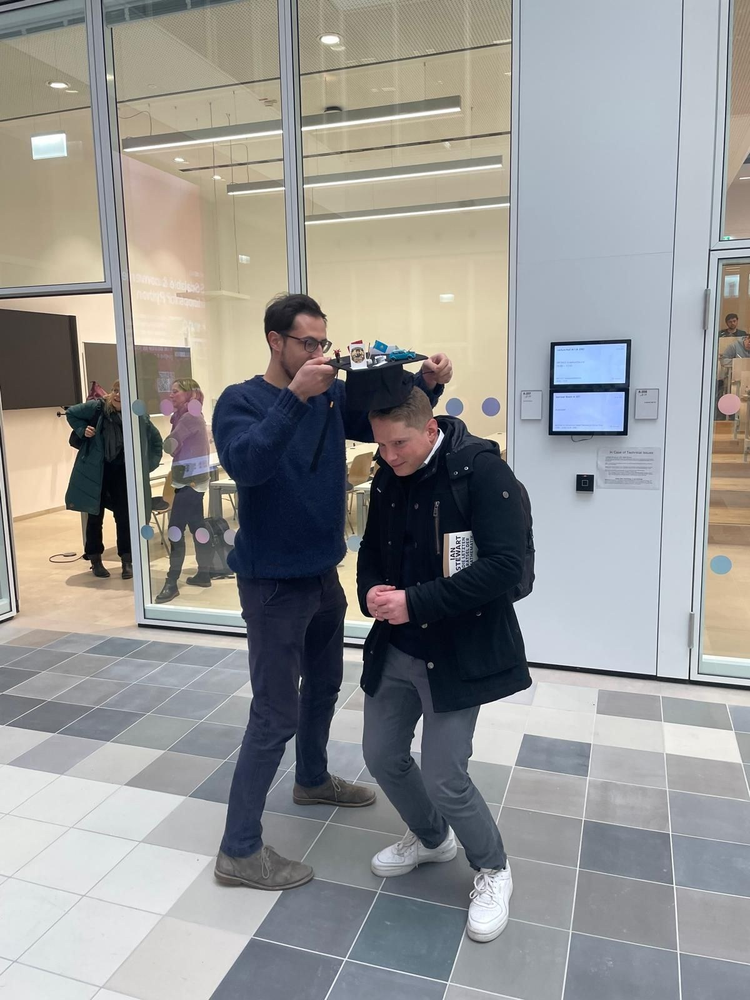
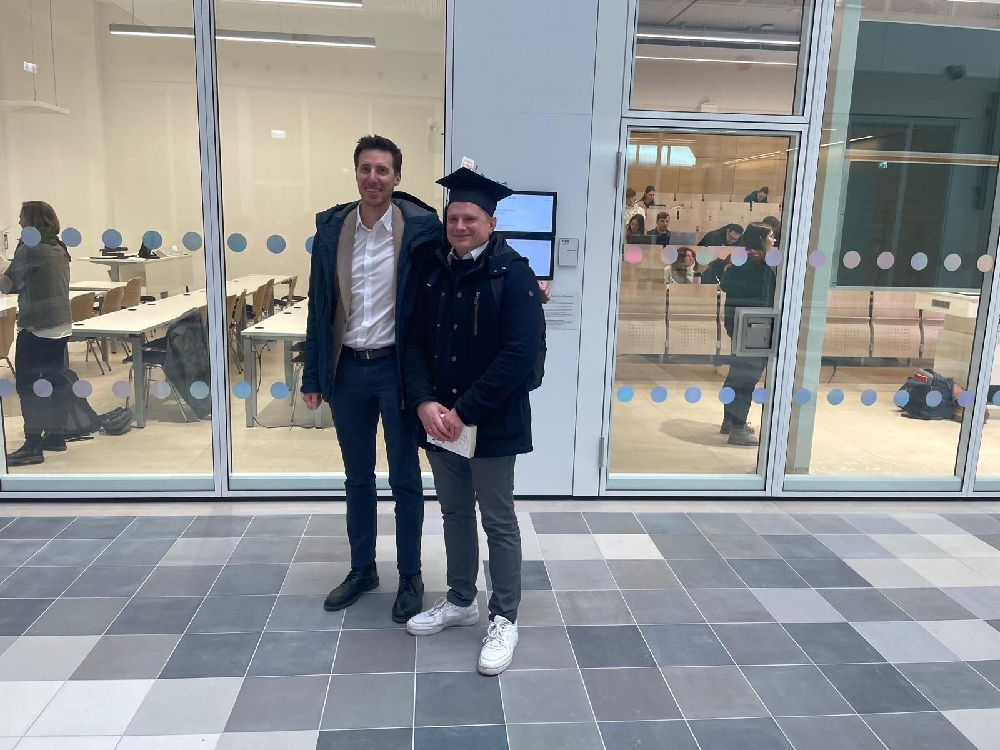
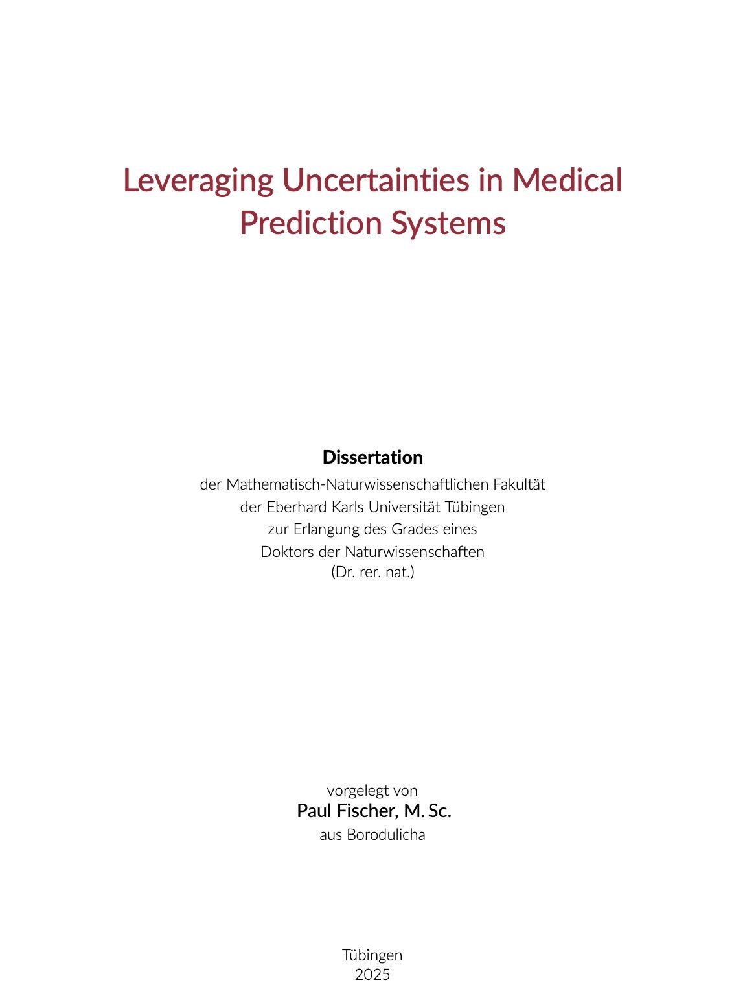

Paul Fischer successfully defended his PhD thesis *Leveraging Uncertainties in Medical Prediction Systems* at the University of Tübingen on 21 January 2026.

Over the course of his PhD, Paul worked on uncertainty quantification in medical prediction systems, ranging from uncertainty estimation in medical image segmentation to [uncertainty-guided MR acquisitions](https://arxiv.org/abs/2508.14952). Since November 2025 he has been working as a post-doc at the Department of Biomedical Engineering at the University of Basel.

Congratulations, Dr. Fischer!

## Images

::: {.gallery}

{alt="The doctoral hat is placed on Paul after the defence"}

{alt="Paul Fischer with Christian Baumgartner after the defence"}

{alt="Title page of Paul Fischer's dissertation"}

:::
