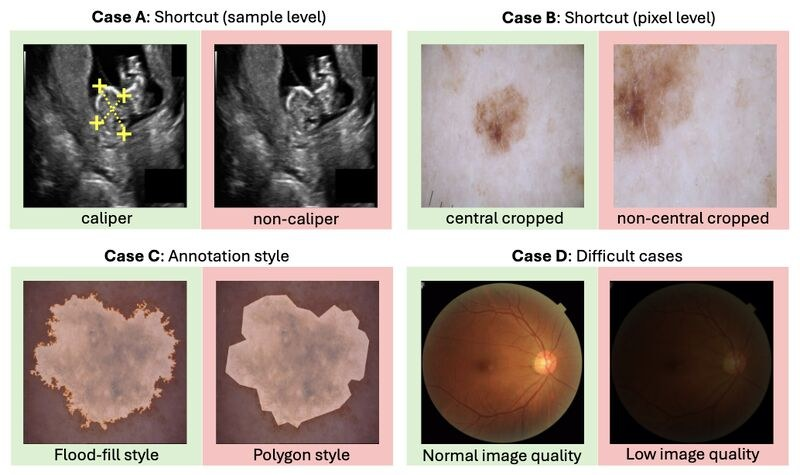

How can we identify samples that systematically underperform in medical image segmentation tasks?

We address this question in our MIDL 2026 spotlight paper [*SEG4SEG: Identifying Systematic Failure Modes in Segmentation by Subgroup Discovery Methods*](https://openreview.net/forum?id=dbZEIwiAon), led by Nina Weng during her research stay in our group last summer.

Segmentation models can achieve great overall metrics but still fail systematically on hidden subgroups. For example, a segmentation algorithm might silently underperform on a group of images with a previously unknown artefact, or on a group of images that followed a different annotation style. SEG4SEG allows us to identify such underperforming groups by extending Slice Discovery Methods, which so far have been applied almost exclusively to classification, to segmentation.

Key contributions:

- SEG4SEG, an algorithm that can reliably identify various types of hidden subgroups in a wide variety of segmentation tasks.
- A comprehensive taxonomy of potential systematic failure modes in medical image segmentation.
- Principled success criteria for evaluating whether a subgroup discovery method actually found a meaningful subgroup.

{fig-alt="Examples of sample-level shortcuts, pixel-level shortcuts, annotation style differences, and difficult cases"}

Joint work with Nina Weng, Eike Petersen, Alceu Bissoto, [Susu Sun](../../people/sun-susu/index.qmd), Lisa M. Koch, Aasa Feragen and Siavash Bigdeli.

Paper: [https://openreview.net/forum?id=dbZEIwiAon](https://openreview.net/forum?id=dbZEIwiAon)  
Project page: [https://nina-weng.github.io/seg4seg.github.io](https://nina-weng.github.io/seg4seg.github.io)  
Code: [https://github.com/nina-weng/seg4seg](https://github.com/nina-weng/seg4seg)
