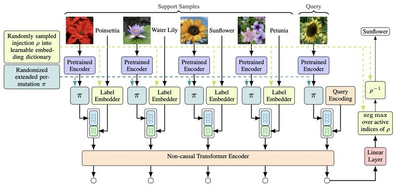

We are very excited to share that our paper [*Universal Algorithm-Implicit Learning*](https://arxiv.org/abs/2602.14761) has been accepted at ICML 2026.

**The promise.** Meta-learning aims to create algorithms that do not learn a specific task, but rather "learn to learn" new tasks with minimal supervision. Practically, this means we could have a base network that adapts to *any* task with just a few training examples.

**The reality.** Current meta-learning algorithms are not flexible enough to actually be used this way. Most are trained with fixed constraints, such as a fixed number of output classes, and evaluated only on toy benchmarks.

**The fix.** In this paper we propose TAIL, a new meta-learner that generalises across a wide range of image classification tasks and even works on text classification out of the box, without ever having been trained on text. Our method treats prediction as a sequence completion task and uses a transformer trained on a large meta-dataset of image classification tasks to solve it.

TAIL is

- **robust**: achieves state-of-the-art classification on various benchmarks,
- **cross-modal**: trained on images, it generalises to text,
- **flexible**: handles arbitrary label spaces and up to 20× more classes than seen during training,
- **fast**: predicts orders of magnitude faster than other transformer-based meta-learners.

{fig-alt="Schematic of the TAIL architecture with pretrained encoders, label embedders and a non-causal transformer encoder"}

This is [Stefano Woerner](../../people/woerner-stefano/index.qmd)'s final paper of his PhD, finishing a strong PhD with a highlight. Huge congratulations to Stefano, and many thanks to Seong Joon Oh for the great collaboration.

Paper: [https://arxiv.org/abs/2602.14761](https://arxiv.org/abs/2602.14761)  
Code: [https://github.com/StefanoWoerner/TAIL](https://github.com/StefanoWoerner/TAIL)
