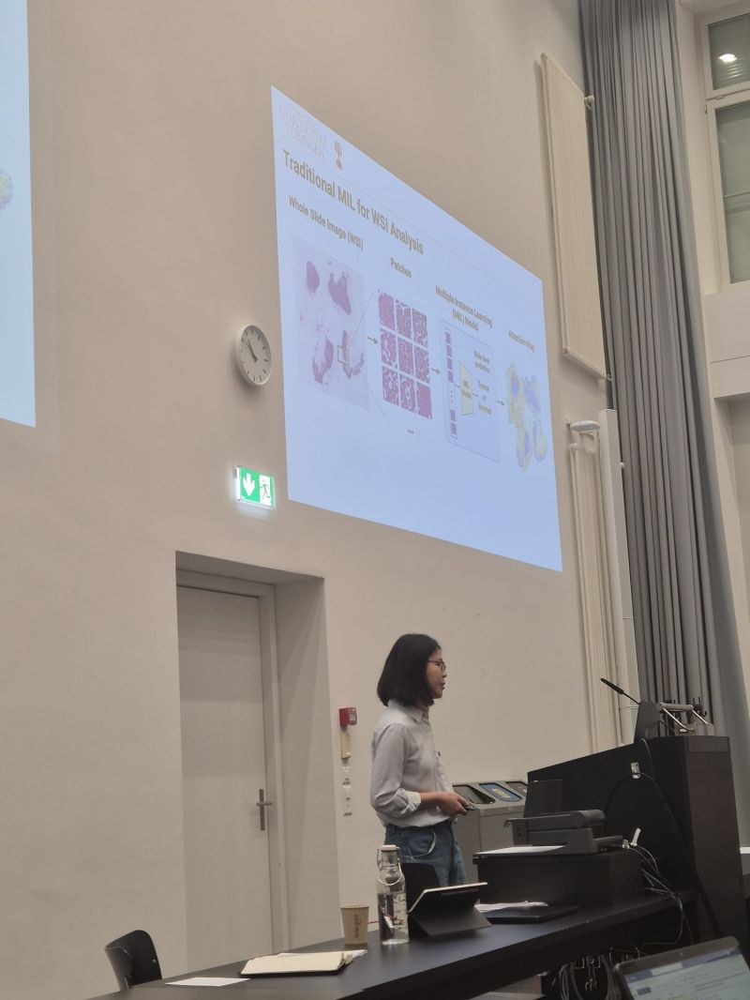
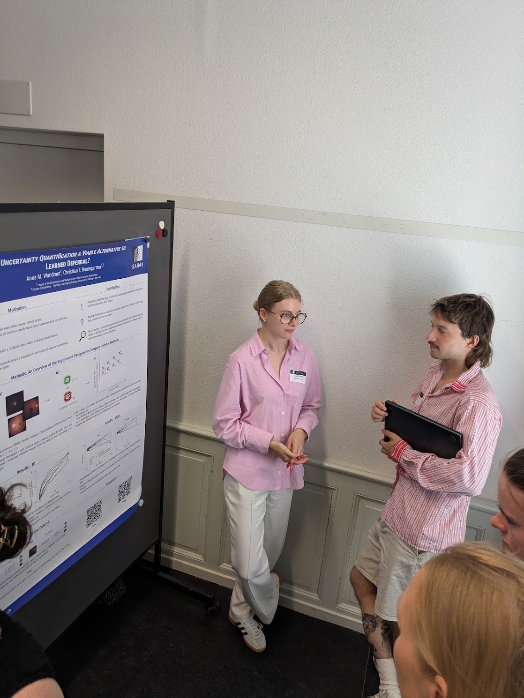
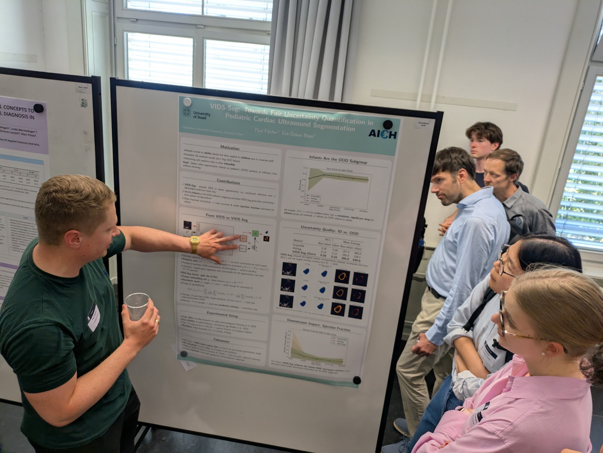

On 18 June 2026 we attended [SAIMI](https://www.saimi.ch/), the Symposium on Artificial Intelligence in Medical Imaging, in Bern. SAIMI brings together the Swiss medical imaging community to present recent advances and discuss open challenges in the field, and Christian is a member of its advisory board.

Two members of our group presented their work:

- [Susu Sun](../../people/sun-susu/index.qmd) gave a talk on her research on interpretable multiple instance learning for the analysis of gigapixel whole slide images.
- [Anna M. Wundram](../../people/wundram-anna/index.qmd) presented a poster on [whether uncertainty quantification is a viable alternative to learned deferral](https://arxiv.org/abs/2508.02319).

It was also a pleasure to see our former PhD student Paul Fischer, who presented his new work on fair uncertainty quantification for pediatric cardiac ultrasound segmentation, carried out in his current group at the University of Basel.

## Images

::: {.gallery}

{alt="Susu Sun giving her talk at SAIMI"}

{alt="Anna Wundram presenting her poster at SAIMI"}

{alt="Paul Fischer presenting his poster at SAIMI"}

:::
