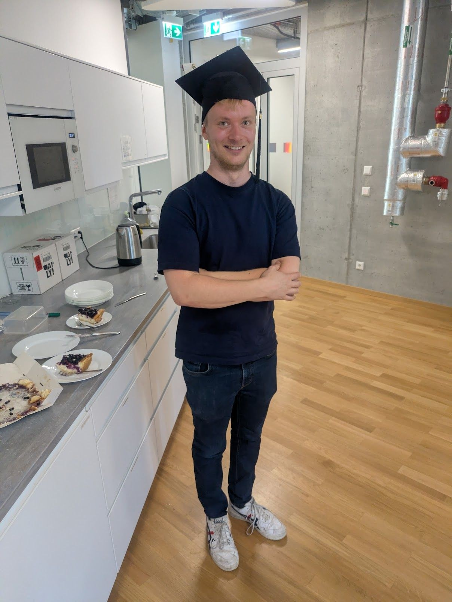
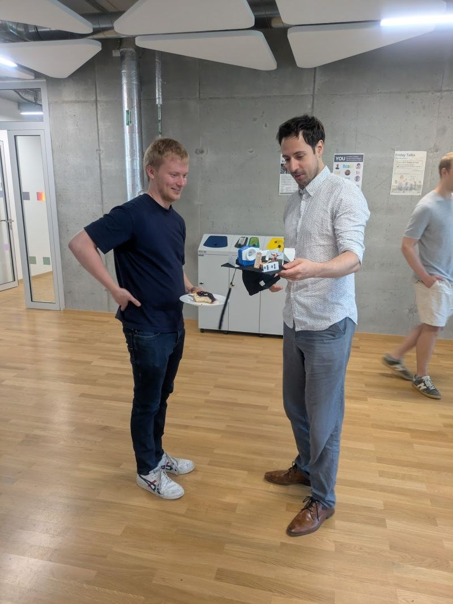
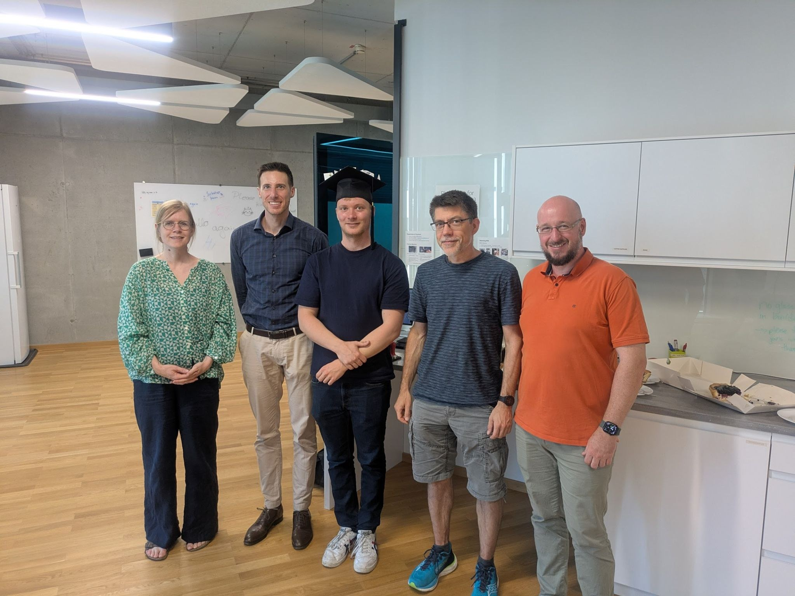
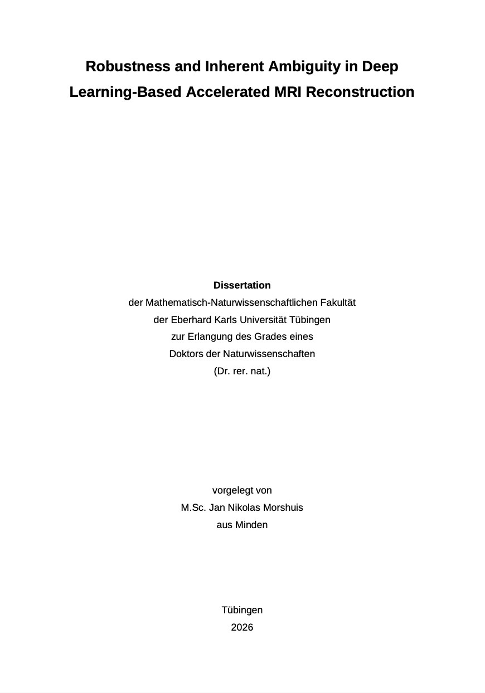

Jan Nikolas Morshuis successfully defended his PhD thesis *Robustness and Inherent Ambiguity in Deep Learning-Based Accelerated MRI Reconstruction* at the University of Tübingen on 24 June 2026.

Nikolas was co-supervised by Christian Baumgartner and Matthias Hein. During his PhD he worked on making deep learning based MR reconstruction more robust and on making its inherent ambiguity visible, including his MICCAI 2025 paper on [uncovering clinically relevant image details through semantically diverse reconstructions](https://arxiv.org/abs/2507.00670).

Congratulations, Dr. Morshuis!

## Images

::: {.gallery}

{alt="Nikolas Morshuis wearing the doctoral hat"}

{alt="Nikolas Morshuis receiving his doctoral hat"}

{alt="Group photo after the defence"}

{alt="Title page of Jan Nikolas Morshuis' dissertation"}

:::
